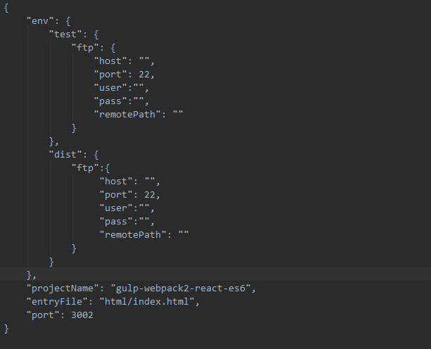

# gulp-webpack2-react-es6

这是一套集合gulp、webpack2.0、react、es6前端自动化构建工具。
- - - 

## 实现的功能
> 1. 支持jsx、es6、es7(装饰器)、less语法
> 2. 热更新，本地环境实时编译和刷新浏览器
> 3. 压缩js、css、html静态资源
> 4. 可以通过配置不同环境（本地、测试、生产）的服务器信息，将编译过后的资源上传到对应的服务器
> 5. 支持多页面应用
> 6. 可以对js、css等资源进行版本控制
> 7. 自动给 css 添加浏览器内核前缀，单独控制css文件的版本号，css modules的局部样式与全局样式共存。

## Installation
	$ npm install  // 如果出现失败，可以通过淘宝镜像
 
如果用的webstorm工具进行开发的话，点击左下角的gulp会看到几个gulp任务流，如下图。  

_start任务是在本地进行开发的时候，双击就可以在浏览器中打开页面。 
 
test_build任务是测试环境下进行构建编译，然后双击test_sftp，就可以把资源上传到测试环境的服务器上，前提是要在.workflowc文件中配置好相关的信息，之后会介绍。  

dist_bulid任务跟test_build任务是类似的，不同的是它是在生产环境下的编译  

mock_sftp任务，考虑到有时候因为项目进度，在本地以及测试环境下需要用到一些模拟数据，就可以把mock文件夹下面的json数据上传到测试服务器上

## 目录结构
##### _task  
	
该目录下面是gulp，webpack的构建任务流，可以基于几种不同的环境（本地、测试、生产）。在webpack中利用html-webpack-plugin、webpack-md5-hash插件来进行资源的版本控制，因为考虑到多页面应用，所以对文件命名有一些要求：在src文件夹下面，html和js文件夹下面的文件名要一一对应，不然编译时会出错。
##### build
在构建时候会出现的文件夹，本地构建以后生成一个dev文件，测试环境构建生成test文件，生产环境构建生成dist文件，下面存放的是构建之后的资源，将这些资源上传到远程服务器。
##### mock  

模拟数据，在本地或者测试环境下的时候需要用到。
##### src  
1. assets文件夹下面放第三方资源，例如一些不能模块化引入的第三方插件、图标库等等。  
2. common文件夹下面可以存放一些公共的资源
3. component文件夹下面是一些组件，以为用了css-loader?modules预处理，所以每个组件可以引用自己单独的样式文件，不会造成全局污染
4. css文件夹下面是全局的css样式，每个组件都会受到影响。
5. html文件夹是多个html（多页面应用），每个html文件需要引用如下两个js   

		 //热更新  
		 //跟每个html文件名对应的js,即入口文件
6. js文件夹存放每个html文件的入口文件。 `注意：js文件夹下面的目录结构要跟html文件夹下面的一直，html文件名要跟js文件名保持一致！`
##### babelrc
babel-loader插件的配置文件。支持es6、es7装饰器、jsx语法  

##### .workflowrc
不同服务器的配置文件，包括（测试test、生产dist）  
host是服务器的主机名，port是服务器的端口号，user是连接服务器的用户名，pass是连接服务器的密码，remotePath是资源上传到服务器的绝对路径名，projectName是该工程名称，要跟工程目录名称保持一致！！！entryFile是本地测试时，浏览器默认打开的页面路径，port是本地服务器的端口号。

